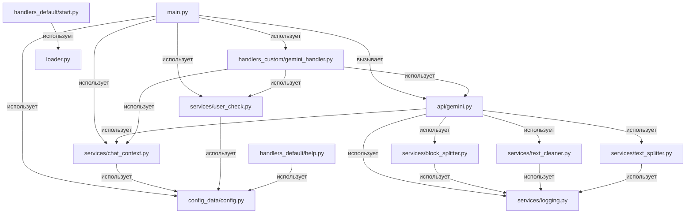

# Описание работы всех модулей проекта chatai

## main.py
Главный файл запуска Telegram-бота. Инициализирует бота, обрабатывает входящие сообщения, реализует устойчивость к ошибкам (повторные попытки при ServiceUnavailable), показывает статус "ИИ готовит ответ", удаляет служебные сообщения, вызывает обработку истории и отправку ответа через API Gemini.

**Зависимости:**
- telebot
- api/gemini.py
- config_data/config.py
- services/chat_context.py
- services/user_check.py

## api/
- gemini.py: Модуль интеграции с Google Gemini API. Формирует запрос, обрабатывает ошибки (ServiceUnavailable, BadRequest, Unauthenticated), сохраняет историю диалога пользователя, логирует ответы ИИ, разбивает текст на части для отправки.

  **Зависимости:**
  - google-genai
  - config_data/config.py
  - services/chat_context.py
  - services/logging.py
  - services/text_cleaner.py
  - services/text_splitter.py
  - services/block_splitter.py

- openrouterai.py: Модуль интеграции с OpenRouterAI (экспериментальный, не используется в production). Формирует запрос, обрабатывает лимиты и ошибки сервиса.

  **Зависимости:**
  - requests
  - config_data/config.py

## config_data/
- config.py: Загрузка переменных окружения (токены, параметры, лимиты) через dotenv. Проверяет наличие необходимых переменных, управляет конфигурацией доступа и лимитов.

  **Зависимости:**
  - python-dotenv
  - os

## handlers/
- handlers_default/start.py: Обработчик команды /start, приветствует пользователя.
- handlers_default/help.py: Обработчик команды /help, выводит список доступных команд.
- handlers_custom/gemini_handler.py: Кастомный обработчик для мультимодальных запросов (текст + фото), формирует parts для Gemini API, реализует обработку ошибок, поддерживает историю диалога.
- handlers_custom/: Папка для пользовательских обработчиков (может быть пуста или содержать кастомные команды).

  **Зависимости:**
  - loader.py (инициализация бота)
  - config_data/config.py
  - services/chat_context.py
  - services/user_check.py
  - api/gemini.py
  - PIL (обработка изображений)

## services/
- block_splitter.py: Разделяет длинные текстовые блоки на части, учитывая лимит Telegram (~3900 символов), поддерживает разбиение кода и текста, логирует результат.

  **Зависимости:**
  - services/logging.py

- chat_context.py: Хранит историю сообщений пользователя, ограничивает длину истории по переменной окружения, добавляет ответы ИИ в историю.

  **Зависимости:**
  - config_data/config.py

- logging.py: Логирует события и данные в директорию logs/, автоматически создаёт папку, сохраняет сообщения с таймстампом.

  **Зависимости:**
  - os
  - datetime

- text_cleaner.py: Очищает и форматирует текст, преобразует маркеры, удаляет лишние символы, логирует результат.

  **Зависимости:**
  - re
  - services/logging.py

- text_splitter.py: Разбивает текст на логические блоки (например, по кодовым секциям), логирует результат.

  **Зависимости:**
  - re
  - services/logging.py

- user_check.py: Проверяет, разрешён ли доступ пользователю по его ID (список разрешённых хранится в переменной окружения).

  **Зависимости:**
  - config_data/config.py

## logs/
Папка для хранения логов работы бота, создаётся автоматически.

## .env_template
Шаблон файла переменных окружения: содержит примеры необходимых переменных (BOT_TOKEN, USER_ID, GEMINI_API_KEY, MAX_HISTORY_LENGTH).

## requirements.txt
Список всех зависимостей проекта для установки через pip.

---

## Схема связей модулей

